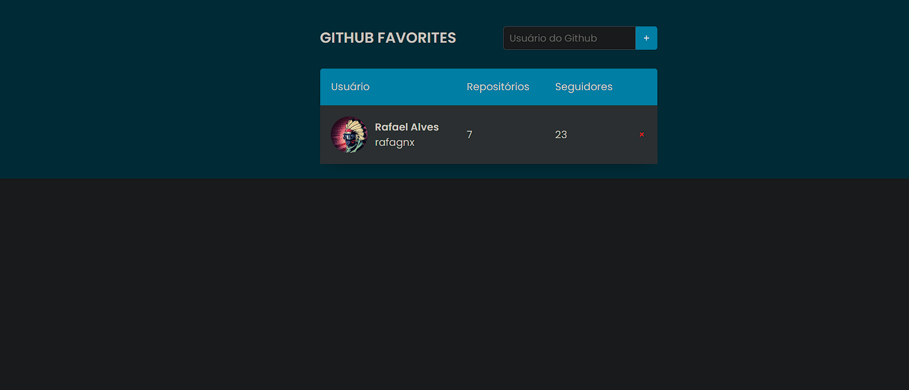

<h1 align="center"> Github Favorites </h1>

## 💻 Projeto

web app Construido no stage 6 do explorer da Rocketseat

  <a href="#-tecnologias">Tecnologias</a>&nbsp;&nbsp;&nbsp;|&nbsp;&nbsp;&nbsp;
  <a href="#-projeto">Projeto</a>&nbsp;&nbsp;&nbsp;|&nbsp;&nbsp;&nbsp;
  <a href="#-layout">Layout</a>&nbsp;&nbsp;&nbsp;|&nbsp;&nbsp;&nbsp;
  <a href="#memo-licença">Licença</a>

  

 

  

## 🚀 Tecnologias

Esse projeto foi desenvolvido com as seguintes tecnologias:

- Classes construtoras
- Higher-Order functions
- async e await
- localStorage
- fetch api
- principios de Imutabilidade na programação

---
Feito com ♥ RafaGnx  [Veja meu portifólio completo!](https://github.com/rafagnx)
